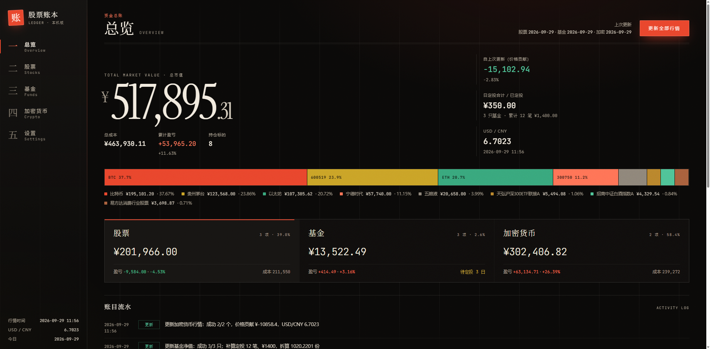
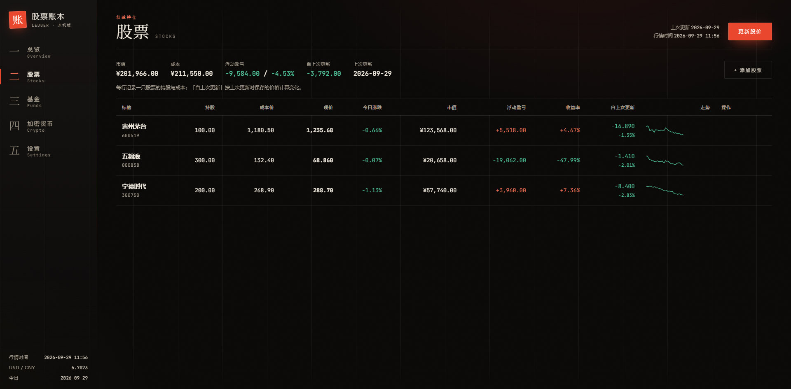
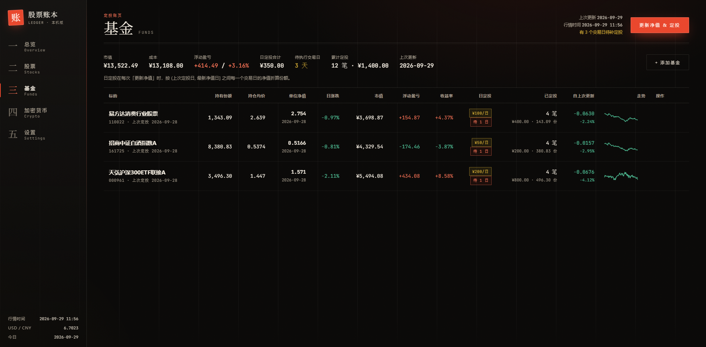
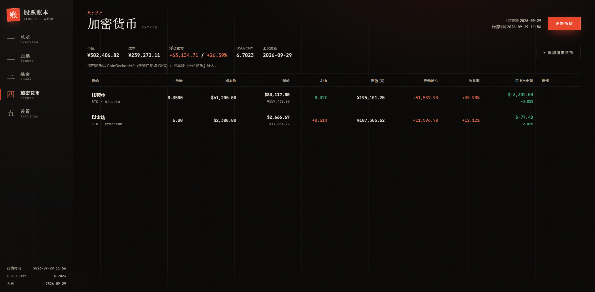
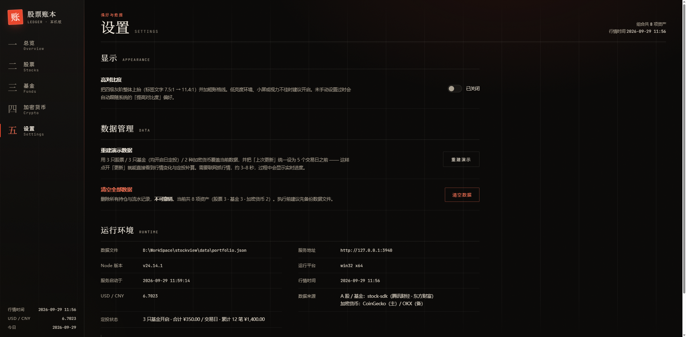
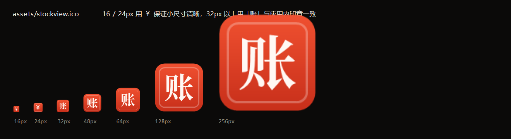
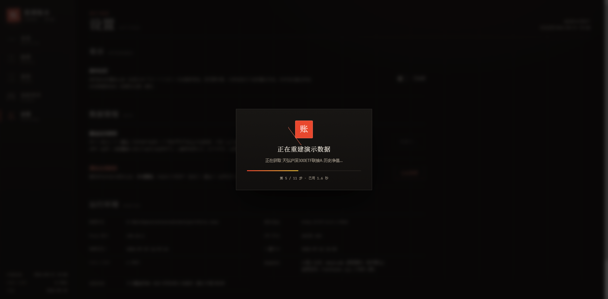

<div align="center">


# 股票账本 · Ledger

**双击即用的本地股票 / 基金 / 加密货币资产统计面板**
自带按**交易日**结算的日定投引擎，数据只存在你自己电脑上


</div>



---

## 为什么做这个

想记个账，结果发现市面上的方案都有点别扭：

- 行情工具大多是 **Python 生态**，为了看个持仓得先配环境；
- 在线记账要**把持仓交给别人的服务器**；
- 表格里记基金定投最麻烦 —— 得自己按每个交易日的净值把金额折算成份额，漏一天就永远对不上。

所以做了这个：**双击一个文件 → 浏览器打开 → 开始记账**。没有后端服务要部署，没有数据库要装，持仓明细就一个 JSON 文件躺在你自己的硬盘上。

---

## 功能

### 五个板块

| 板块 | 能做什么 |
|---|---|
| **总览** | 总市值 / 总成本 / 累计盈亏、持仓配置条与权重、账目流水 |
| **股票** | 持股数量 + 成本价，一键更新股价；自动算浮动盈亏与「自上次更新」的涨跌 |
| **基金** | 份额 + 成本价，**每只基金可单独开启日定投**，按交易日净值自动折算份额 |
| **加密货币** | 数量 + 成本价（USD / CNY 计价），市值统一折算成人民币 |
| **设置** | 高对比度开关、重建演示 / 清空数据、运行环境与数据来源信息 |

### 你不用自己算的几件事

- **定投按交易日结算**：节假日自动跳过，净值没公布的那天会自动留到下次更新补上，**不会漏也不会重复扣**；
- **「自上次更新」是真实窗口涨跌**：用上次更新时存下来的价格作基准，而不是当天的涨跌幅 —— 隔一周再打开，看到的就是这一周的累计变化；
- **均价自动维护**：定投持续累加总成本，持仓均价由 `总成本 ÷ 份额` 反推。

### 界面

**股票** —— 持股 / 成本价 / 现价 / 今日 / 市值 / 盈亏 / 收益率 / 自上次更新 / 走势：



**基金** —— 多出「日定投」「已定投」「待执行」三列，直接看出还有几个交易日等着补算：



**加密货币** —— 现价同时显示原币与人民币，来源会在标的下标注（CoinGecko / OKX）：



**设置** —— 原来散落的小按钮统一收到这里：



配色遵循 A 股习惯：**赚了红色，亏了绿色**。四档灰阶都经过对比度实测，满足 WCAG AA。

---

## 快速开始

### 一、下载即用（推荐）

1. 装 [Node.js](https://nodejs.org) 18 或更高版本（一路下一步即可）；
2. 下载本项目，**双击 `股票账本.exe`**；
3. 首次运行会自动安装行情依赖，随后浏览器自动打开面板。

用的时候别关那个黑色命令行窗口 —— 关掉它 = 停止服务。想换端口：`set STOCKVIEW_PORT=4000 && npm start`。

> 仓库里直接带了编译好的 `股票账本.exe`，所以**不需要任何编译工具**。
> `启动.bat` 是功能完全相同的后备方案（万一 exe 被杀毒软件拦了就用它），两者只差一个图标。

### 二、从源码跑

```bash
git clone https://github.com/Justin-Mai/stockview.git
cd stockview
npm install
npm start            # 启动并自动打开浏览器
```

### 三、重新构建图标与启动器（可选）



图标和 exe 都是脚本生成的，用 **Windows 自带的 .NET Framework 编译器，不需要装任何东西**：

```bash
npm run icon         # 只重新生成 assets/stockview.ico
npm run launcher     # 图标 + 编译 股票账本.exe
```

想换配色或字形：改 `scripts/make-icon.ps1` 里的 `$sealTop / $sealBottom / $cream`，重跑即可 ——
**字形位置是量出来的，不用手工调**（见下方工程笔记）。

---

## 定投是怎么算的

这是整个项目最核心的一块。每次点「更新净值 & 定投」，程序会取出 `(上次定投日, 最新已公布净值日]` 之间的**每一个 A 股交易日**，按当日单位净值把金额折算成份额：

```
新增份额   = 当日定投金额 ÷ 当日单位净值
新持有份额 = 原份额 + Σ 每个交易日的新增份额
新总成本   = 原总成本 + Σ 每日定投金额
持仓均价   = 总成本 ÷ 持有份额
```

几个刻意的设计：

- **只认已公布的净值**。场外基金当日净值一般晚上才出，所以白天的更新只会补「昨天及以前」的交易日，今天那笔留到下次更新自动补上 —— 界面上直接显示**还有几个交易日待补定投**。
- **没有净值就记一笔跳过**。某天基金暂停申赎、没有公布净值，程序把它标记为已跳过，不会反复重试、也不会算错。
- **幂等**。连续点两次更新不会重复扣款，`npm run selftest` 里有专门一步验证这点。

> 实测：2026-09-25（中秋）不是交易日，程序正确地没有扣款。

---

## 行情数据从哪来

### 股票 / 基金 —— [stock-sdk](https://github.com/chengzuopeng/stock-sdk)

零依赖的 JS 行情 SDK，浏览器和 Node 都能跑。本项目用到：

| 用途 | 接口 |
|---|---|
| A 股实时行情 | `sdk.quotes.cnSimple()` |
| 公募基金实时净值 | `sdk.quotes.fund()` |
| 历史日线 | `sdk.kline.cn()` |
| **基金历史净值**（定投折算的依据） | `sdk.fund.navHistory()` |
| **交易日历** | `sdk.reference.tradingCalendar()` |
| 代码 / 名称 / 拼音搜索 | `sdk.search()` |

底层是腾讯财经 / 东方财富的公开接口，**非实时撮合，通常有数十秒到数分钟延迟** —— 适合记账估值，不适合高频交易决策。

### 加密货币 —— CoinGecko 主源 + OKX 兜底

调研了 GitHub 上的主流方案后的取舍：

| 项目 | 结论 |
|---|---|
| [ccxt](https://github.com/ccxt/ccxt) | 覆盖 100+ 交易所，能力最强；但体积大，且国内直连交易所域名常被墙 |
| CoinGecko 公开 REST | 无需 API Key、原生支持 CNY 计价与历史区间价格 → **主源** |
| OKX 公开 REST | 国内可直连 → **备用源**（现价 + 日线） |
| Binance 公开 REST | 本网络实测 **451**（地区限制），未启用 |

本机实测连通性：`api.coingecko.com` ✅ 200 ／ `www.okx.com` ✅ 200 ／ `api.binance.com` ❌ 451。

USD/CNY 汇率依次尝试：CoinGecko（USDT 报价推导）→ [frankfurter](https://www.frankfurter.app) → [er-api](https://open.er-api.com)，三者实测一致（6.7105 / 6.7118）。

---

## 项目结构

```
stockview/
├── 股票账本.exe              ← 双击这个（带图标）
├── 启动.bat                  ← 等价后备方案
├── assets/stockview.ico      ← 七尺寸应用图标
├── launcher/Launcher.cs      ← 启动器源码（只调用 启动.bat）
├── server/
│   ├── index.js              ← HTTP 服务 + REST API（零第三方依赖）
│   ├── store.js              ← 本地 JSON 存储（临时文件 + 原子重命名）
│   ├── portfolio.js          ← 核心：估值、增删改、更新引擎、定投补算
│   ├── tasks.js              ← 长任务进度追踪
│   ├── seed.js               ← 演示数据构造
│   ├── util.js               ← 日期 / 精度 / 并发 / 缓存工具
│   └── providers/
│       ├── cn.js             ← A 股 / 基金（stock-sdk）
│       └── crypto.js         ← 加密货币（CoinGecko + OKX）
├── web/                      ← 前端，原生 HTML/CSS/JS，无构建步骤
├── scripts/                  ← 图标生成、启动器编译、四个自检脚本
└── data/                     ← 运行时生成，已 gitignore（见下方隐私说明）
```

**技术选型上刻意的克制**：前端不用框架、不用打包器，后端**只装一个运行时依赖**（stock-sdk）。目的是让这个项目十年后还能打开就用，而不是先跟依赖版本打架。

---

## HTTP 接口

服务默认跑在 `127.0.0.1:3939`（端口被占用会自动顺延）。前端就是这套 API 的一个消费者，你也可以直接调：

| 方法 | 路径 | 说明 |
|---|---|---|
| GET | `/api/state` | 完整快照（含估值、权重、定投统计、流水） |
| POST | `/api/assets` | 新增资产 `{scope, data}` |
| PATCH | `/api/assets` | 修改资产 `{scope, id, data}` |
| DELETE | `/api/assets?scope=&id=` | 删除资产 |
| POST | `/api/update` | 执行更新 `{scope: 'stock'\|'fund'\|'crypto'\|'all'}` |
| GET | `/api/lookup?scope=&code=` | 新增前预览行情 |
| GET | `/api/search?scope=&q=` | 代码 / 名称联想 |
| POST | `/api/reset` | `{mode:'empty'\|'demo'}` 清空或重建演示数据 |
| GET | `/api/task` | 当前长任务进度（前端轮询显示实时步骤） |

---

## 开发者自检

四个脚本，都是用真实数据 / 真实浏览器跑的，不是 mock：

```bash
npm run selftest     # 后端端到端：真实行情 + 定投补算 + 幂等性校验
npm run contrast     # 可读性：无头浏览器实测 17 处文字的对比度（标准 + 高对比度）
npm run uicheck      # 交互：无头浏览器走一遍增删改 / 更新流程并截图
npm run seed         # 重新生成演示数据
```

`selftest` 会打印每一步明细，其中「重复更新」一步专门验证**连续点两次不会重复扣定投**。

`contrast` 的输出形如：

```
元素                 字号     对比度    要求   结果
总览 · 配置图例     11.5px   7.49:1   4.5:1  ✓
股票 · 面板标签       11px   7.49:1   4.5:1  ✓
侧脊 · 功能链接     11.5px   11.35:1  4.5:1  ✓   （高对比度模式）
✓ 全部达标
```

---

## 常见问题

**Q：点了更新，基金份额没变？**
看顶部提示「还有几个交易日待补定投」。场外基金当日净值一般 20:00 后才公布，白天的更新只补昨天及以前。

**Q：点了「重建演示数据」感觉没反应？**
它要联网抓 8 个标的的行情，实测约 **2.5 秒**。点击后会弹出遮罩并实时显示进度（进度来自服务端 `/api/task`，不是假动画）；「清空数据」是纯本地操作，50 毫秒完成。



**Q：更新失败 / 取不到价格？**
行情源是公开接口，偶发限流或被墙。加密货币遇到 CoinGecko 限流会自动切 OKX、汇率会依次换源，股票基金可稍后重试。

**Q：数据存哪？会上传吗？**
只存在 `data/portfolio.json`，不会上传到任何地方。复制这个文件就是备份。写入采用「临时文件 + 原子重命名」，文件损坏时会自动留档到 `data/backups/`。

**Q：成本价和总成本是什么关系？**
`总成本 = 数量 × 成本价`。基金开启定投后总成本持续累加。修改资产时**只提交你真正改过的字段** —— 只改「总成本」就不会被成本价覆盖。

**Q：可以同时开两个实例吗？**
不建议。两个实例共用一个 `data/portfolio.json`，写盘本身是原子的（临时文件 + 重命名），但「读—改—写」之间**没有跨进程锁**，同时操作可能互相覆盖。要换端口重开，先关掉旧窗口。启动时若 3939 被占用，程序会自动顺延到 3940、3941…，看窗口里打印的地址即可。

---

## 工程笔记

几个踩过的坑，都是**只看代码发现不了、必须实测**的那类，留个记录。

**1. 备用源返回 HTTP 200，但其实是空的。**
OKX 的交易对是 `BTC-USDT`，而我一开始用 CoinGecko 的币种 id 去猜，发出了 `BITCOIN-USDT`。
问题在于 OKX 对不存在的交易对返回的是 **200 + `{"code":"51001","data":[]}`**，不抛异常 ——
于是「自动切换备用源」这个特性**静默失效**，还因为代码不报错而一直没被发现。
现在按「调用方提示 → 内置币种表 → id 大写」三级解析符号，并用「把返回价换算回 USDT 与 OKX 日线收盘比对」的方式验证来源。

**2. 缓存函数没有按参数区分。**
`memo(fn)` 一开始只存了一个值，于是 `getPrices(['bitcoin'])` 之后 60 秒内调
`getPrices(['ethereum'])` 会拿到**比特币的结果**。已改为按序列化后的参数分别缓存。

**3. 图标的字看起来偏左上，量出来确实偏了。**
`DrawString` 的 Center 对齐居中的是**字身宽度**而不是**墨迹**，再加上我手调的一个「视觉补偿」，
结果 256px 上字形**纵向偏高 10px**（占画布 4%）。现在改成闭环：画 → 扫描像素量墨迹边界 →
反推位移 → 画进成品 → 与「只有底色」的版本相减量残差 → 修正，直到 ≤0.5px（像素栅格的理论极限）。
`npm run icon` 每次都会打印每个尺寸的实测残差。

**4. Windows 的 .bat 不能带自定义图标。**
它不是可执行文件，没有资源段。资源管理器显示的图标来自文件类型关联（`HKCR\batfile`），全局生效、无法逐文件定制。
所以本项目编译了一个几 KB 的启动器 exe，把图标作为资源嵌进去，**启动逻辑仍然只有 `启动.bat` 一份**，不会出现两套实现。

**5. PowerShell 的 `[int]` 是四舍五入，不是截断。**
写 ICO 的 AND 掩码时用 `[int]($x / 8)` 取字节下标，每行最后一个像素会**多算一格**导致越界。
改用位移 `($x -shr 3)`。

**6. 数据文件莫名涨到 742KB。**
原因是 `fundNavHistory()` 返回的是基金**成立以来的全量净值**（老基金有 3895 条），
而演示数据构造直接把它整个存了进去，绕过了更新时的截断逻辑。统一收口后：**742KB → 57KB**。

---

## 已知边界

- **只做 A 股与公募基金**（港股 / 美股未接入，数据模型预留了市场字段）；
- 加密货币**没有做定投**（按需求只在基金板块实现），也没有多币种账户、手续费、分红再投的精算；
- 定投按「已公布的净值日期」逐个交易日结算，**不预测、不补未来**；
- 图标生成与启动器编译依赖 Windows（.NET Framework 的 `csc.exe`）；服务本身跨平台，非 Windows 可直接 `npm start` 用浏览器访问；
- 实时行情有数十秒到数分钟延迟，非交易时段显示最近一个交易日的收盘价 / 净值。

## 隐私说明

`data/` 目录已在 `.gitignore` 中 —— 持仓明细属于个人数据，不应该跟着仓库上云。
克隆下来是干净的，程序首次写入时会自动创建这个目录。

## 许可

[ISC](LICENSE) © 2026
